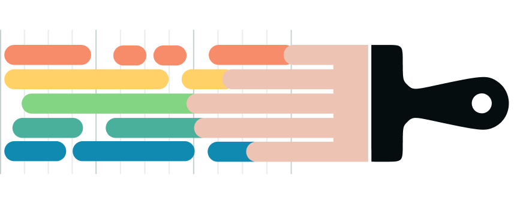

# Figaro Fingerpainting

A collaborative, multiplayer fingerpainting experience — participants paint together in real time on a shared canvas, built as part of an ASU-affiliated initiative designing wellness interactives for home care, originally aimed at Alzheimer's patients and their caregivers. The mandate was minimal-tech, sensor-based interactives supporting things like mobility and connection.

This repo documents the TouchDesigner prototyping process, including an early multi-user browser-based prototype connected over WebSockets via ngrok, through to the final browser-based (JavaScript) version that shipped.

## My Role

Consultant, project manager, and developer on this initiative — spanning interactive design, TouchDesigner prototyping, and the eventual browser-based implementation.

## Iterations

- [`01-audio-fingerpaint-2021/`](01-audio-fingerpaint-2021/) — earliest audio-reactive fingerpainting prototype
- [`02-feedback-motion-detect-2022/`](02-feedback-motion-detect-2022/) — motion-detection-driven iteration
- [`03-fingerpainting-ngrok-2024/`](03-fingerpainting-ngrok-2024/) — multi-user browser-based prototype, connected over WebSockets via ngrok for remote/multi-device interaction
- [`final-js-version/`](final-js-version/) — the final, deployed browser-based version (case study only)

## Requirements

- [TouchDesigner](https://derivative.ca/) (macOS) for the numbered iteration folders
